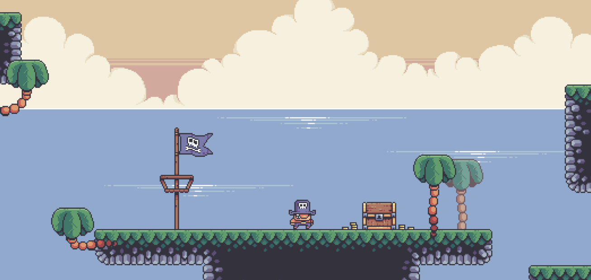

# The Cursed Pirate!

Created for a talk in 2020, 'The Cursed Pirate' has been a constant during Indigo's development, and has kept pace will all of the new versions and features.



Our poor pirate finds himself trapped on an island he cannot escape.

Use the spacebar or up to jump, and the left and right arrow keys to move.

## Running the demo locally

```scala
sbt runGame
```
